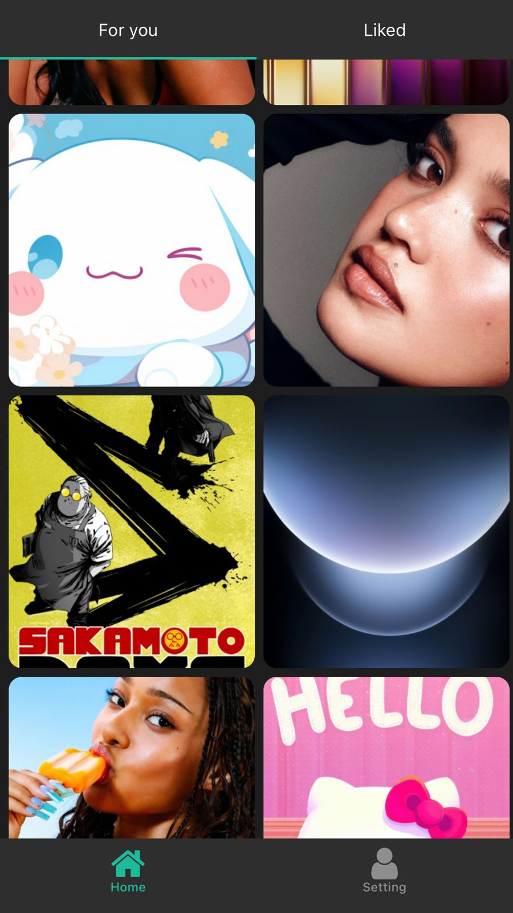

# Wallz

Wallz is a React Native app built with Expo that allows users to browse, view, and save wallpapers. It supports smooth scrolling, multiple image categories, and efficient image rendering for a seamless user experience.

# Tech Stack

- Expo
- AsyncStorage(2.0)
- Expo-router
- React-Navigation
- NativeWind
- Expo vector icons

## Features

- Browse high-quality wallpapers
- 2000+ wallpapers
- View wallpapers in full screen
- Save wallpapers to your device gallery
- Smooth scrolling with optimized FlatList rendering
- Responsive design for different screen sizes
- Dark and light mode support

## Screenshots



(More APP UI)[./screenshots]

## Installation

### Prerequisites

- Node.js >= 16
- Expo CLI
- npm or yarn

### Clone the repository:

```bash
git clone https://github.com/david-rai/wallz.git
```
